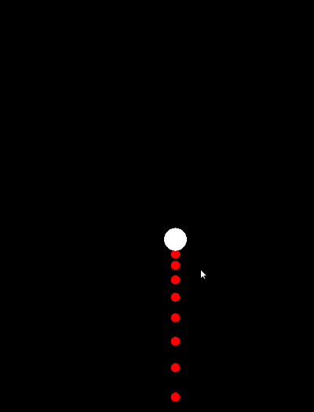

# Box2d刚体轨迹预测

#### 前言

在游戏开发中经常会接触到各种物理引擎，虽然开源的引擎各种各样，但是基本原理是相通的。实质上物理引擎只是以时间为单位的刷新物理世界中的刚体的位置（其中运用了大量物理公式和知识），然后刷新刚体关联的物品（节点）的位置来达到模拟效果。其中的细节是我们开发者不需要知道，也不知道的。所以刚体轨迹预测成为了难题。

#### 物理公式

在开始之前先补一下高中基础物理公式（主要涉及匀加速直线运动）：

1. 速度公式  $v=v_0+at$

2. 距离公式  $s=v_0t+\frac{1}{2}at^2$

3. 阻尼公式 $v=v-kv_0t$ (比较贴近)

   $v_0$是指运动物体的`初始速度`，$t$是指运动物体的`运动时间`，$v$是指运动物体的`结束速度`，$s$是指运动物体`运动距离`，$a$是指运动物体的`运动加速度`，$k$是指运动物体的`阻尼系数`(模拟的空气阻尼等)。

#### 运动分解

